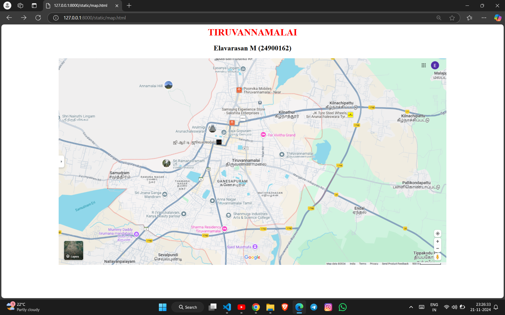
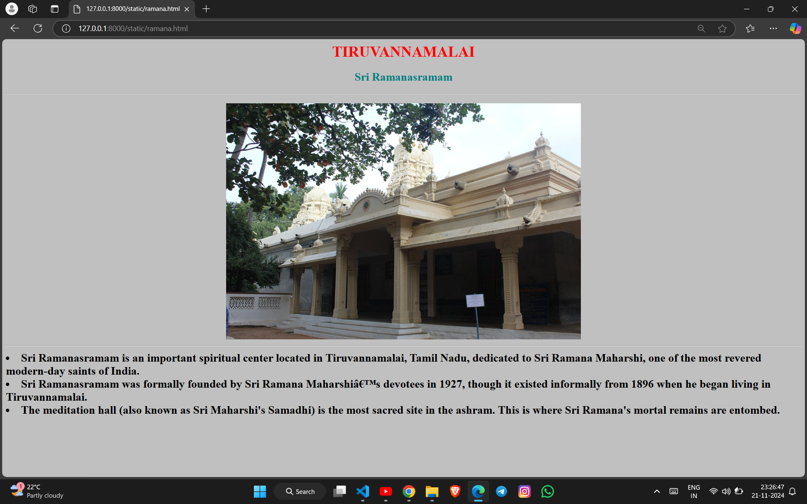
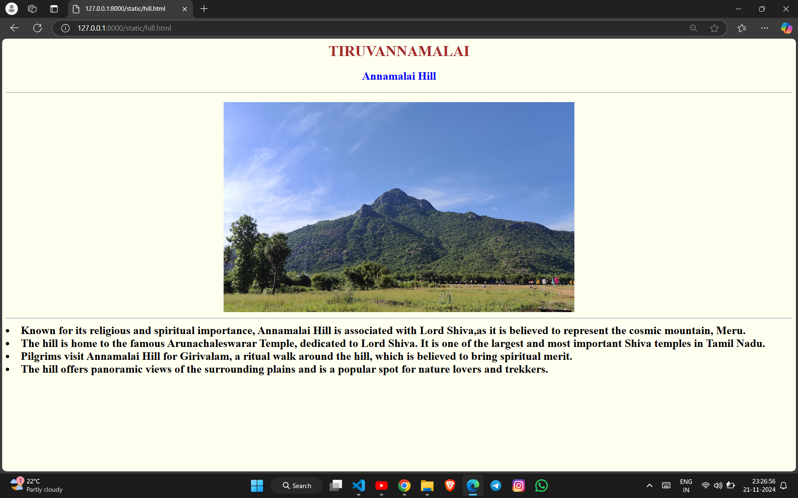
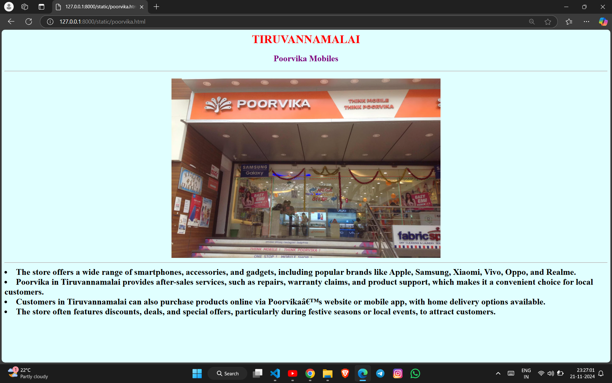
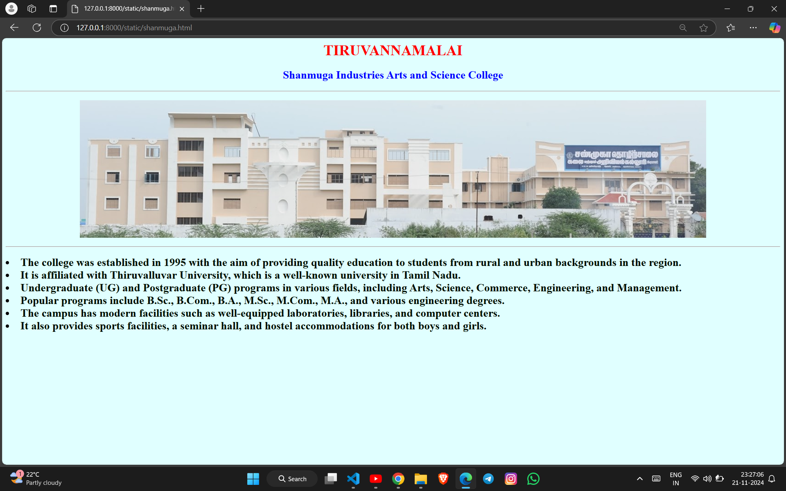

# Ex04 Places Around Me
## Date: 21-11-2024
## AIM
To develop a website to display details about the places around my house.

## DESIGN STEPS

### STEP 1
Create a Django admin interface.

### STEP 2
Download your city map from Google.

### STEP 3
Using ```<map>``` tag name the map.

### STEP 4
Create clickable regions in the image using ```<area>``` tag.

### STEP 5
Write HTML programs for all the regions identified.

### STEP 6
Execute the programs and publish them.

## CODE
```
map.html

<html>
    <body>
        <h1 align="center">
        <font color="red"><b>TIRUVANNAMALAI</b></font>
        </h1>
        <h2 align="center">
            <b>
                Elavarasan M (24900162)
            </b>
        </h2>
        <h3 align="center">
            

            <map name="image-map">
            <area target="" alt="Raja Gopuram" title="Raja Gopuram" href="gopuram.html" coords="546,235,665,266" shape="rect">
            <area target="" alt="Sri Ramanasramam" title="Sri Ramanasramam" href="ramana.html" coords="342,336,506,376" shape="rect">
            <area target="" alt="Shanmuga Industries Arts and Science College" title="Shanmuga Industries Arts and Science College" href="shanmuga.html" coords="559,512,729,554" shape="rect">
            <area target="" alt="Annamalai Hill" title="Annamalai Hill" href="hill.html" coords="263,73,398,110" shape="rect">
            <area target="" alt="Poorvika Mobiles" title="Poorvika Mobiles" href="poorvika.html" coords="587,88,768,127" shape="rect">
</map>
        </h3>
    </body>
</html>

gopuram.html

<html>

<body bgcolor="lavender">
    <h1 align="center">
        <font color="red">
            TIRUVANNAMALAI
        </font>
    </h1>
    <h2 align="center">
        Raja Gopuram
    </h2>
    <hr>
    <h3>
        <center>
            
        </center>
        <br>
        <hr>
        <li>
            <font size="5">
                The Raja Gopuram is the grand entrance tower of the Arunachaleswarar Temple in Tiruvannamalai, Tamil
                Nadu.
            </font>
        </li>
        <li>
            <font size="5">
                It is situated in Tiruvannamalai, a significant pilgrimage town in Tamil Nadu, known for the
                Arunachaleswarar Temple dedicated to Lord Shiva.
            </font>
        </li>
        <li>
            <font size="5">
                The Raja Gopuram is one of the tallest gopurams (gateway towers) in Tamil Nadu, standing at a height of
                about 66 meters (216 feet).
            </font>
        </li>
        <li>
            <font size="5">
                The tower is richly decorated with sculptures depicting scenes from Hindu mythology, including deities,
                demons, and celestial beings, all rendered with great artistic detail.
            </font>
        </li>
    </h3>
</body>

</html>

ramana.html

<html>

<body bgcolor="silver">
    <h1 align="center">
        <font color="red">
            TIRUVANNAMALAI
        </font>
    </h1>
    <h2 align="center">
        <font color="teal">
            Sri Ramanasramam
        </font>
    </h2>
    <hr>
    <h2>
        <center>
            
        </center>
        <hr>
        <li>
            <font>
            Sri Ramanasramam is an important spiritual center located in Tiruvannamalai, Tamil Nadu, dedicated to Sri
            Ramana Maharshi, one of the most revered modern-day saints of India.
            </font>
        </li>
        <li>
            <font>
            Sri Ramanasramam was formally founded by Sri Ramana Maharshi’s devotees in 1927, though it existed
            informally from 1896 when he began living in Tiruvannamalai.
            </font>
        </li>
        <li>
            <font>
                The meditation hall (also known as Sri Maharshi's Samadhi) is the most sacred site in the ashram. This is where Sri Ramana's mortal remains are entombed.
            </font>
        </li>
    </h2>
</body>

</html>

hill.html

<html>

<body bgcolor="ivory">
    <h1 align="center">
        <font color="brown">
            TIRUVANNAMALAI
        </font>
    </h1>
    <h2 align="center">
        <font color="blue">
            Annamalai Hill
        </font>
    </h2>
    <hr>
    <h2>
        <center>
            
            <hr>
            <li align="left">
                Known for its religious and spiritual importance, Annamalai Hill is associated with Lord Shiva,as it is believed to represent the cosmic mountain, Meru.
            </li>
            <li align="left">
                The hill is home to the famous Arunachaleswarar Temple, dedicated to Lord Shiva. It is one of the largest and most important Shiva temples in Tamil Nadu.
            </li>
            <li align="left">
                Pilgrims visit Annamalai Hill for Girivalam, a ritual walk around the hill, which is believed to bring spiritual merit.
            </li>
            <li align="left">
                The hill offers panoramic views of the surrounding plains and is a popular spot for nature lovers and trekkers.
            </li>
    </h2>
</body>

</html>

poorvika.html

<html>

<body bgcolor="#E0FFFF">
    <h1 align="center">
        <font color="red">
            TIRUVANNAMALAI
        </font>
    </h1>
    <h2 align="center">
        <font color="purple">
            Poorvika Mobiles
        </font>
    </h2>
    <hr>
    <h2>
        <center>
            
        <hr>
        <li align="left">
            <font size="5">
                The store offers a wide range of smartphones, accessories, and gadgets, including popular brands like
                Apple, Samsung, Xiaomi, Vivo, Oppo, and Realme.
            </font>
        </li>
        <li align="left">
            <font size="5">
                Poorvika in Tiruvannamalai provides after-sales services, such as repairs, warranty claims, and product
                support, which makes it a convenient choice for local customers.
            </font>
        </li>
        <li align="left">
            <font size="5">
                Customers in Tiruvannamalai can also purchase products online via Poorvika’s website or mobile app, with
                home delivery options available.
            </font>
        </li>
        <li align="left">
            <font size="5">
                The store often features discounts, deals, and special offers, particularly during festive seasons or local events, to attract customers.
            </font>
        </li>
    </h2>
</body>

</html>

shanmuga.html

<html>
<body bgcolor="#E0FFFF">
    <h1 align="center">
        <font color="red">
            TIRUVANNAMALAI
        </font>
    </h1>
    <h2 align="center">
        <font color="blue">
        Shanmuga Industries Arts and Science College
    </font>
    </h2>
    <hr color-="yellow">
    <h3>
        <center>
            
        </center>
    </h3>
    <hr>
    <h2>
        <li>
            <font color="none">
            The college was established in 1995 with the aim of providing quality education to students from rural and
            urban backgrounds in the region.
            </font>
        </li>
        <li>
            <font color="none">
            It is affiliated with Thiruvalluvar University, which is a well-known university in Tamil Nadu.
            </font>
        </li>
        <li>
            <font color="none">
            Undergraduate (UG) and Postgraduate (PG) programs in various fields, including Arts, Science, Commerce,
            Engineering, and Management.
            </font>
        </li>
        <li>
            <font color="none">
            Popular programs include B.Sc., B.Com., B.A., M.Sc., M.Com., M.A., and various engineering degrees.
        </font>
        </li>
        <li>
            <font color="none">
            The campus has modern facilities such as well-equipped laboratories, libraries, and computer centers.
            </font>
        </li>
        <li>
            <font color="none">
            It also provides sports facilities, a seminar hall, and hostel accommodations for both boys and girls.
            </font>
        </li>
    </h2>
</body>

</html>
```

## OUTPUT











## RESULT
The program for implementing image maps using HTML is executed successfully.
